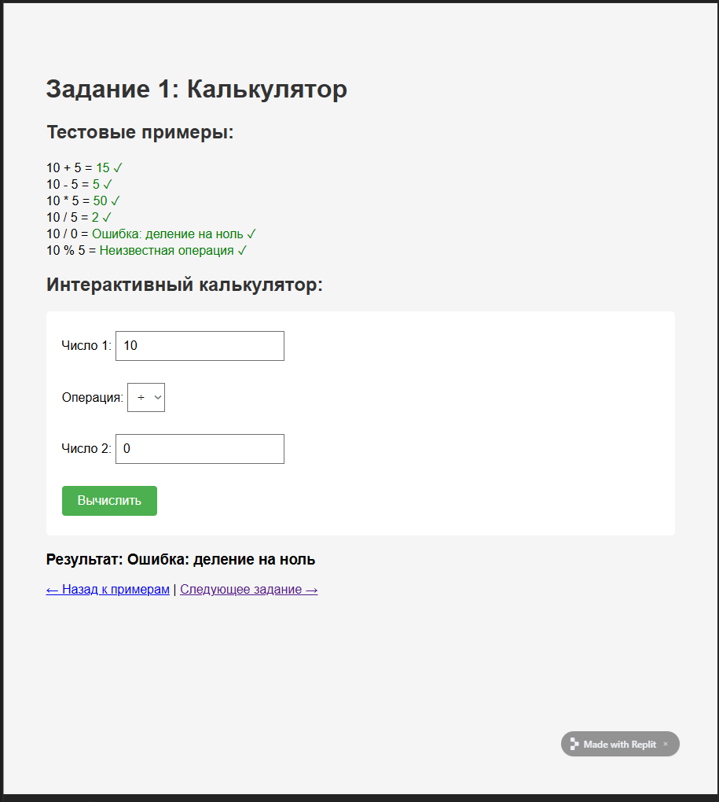
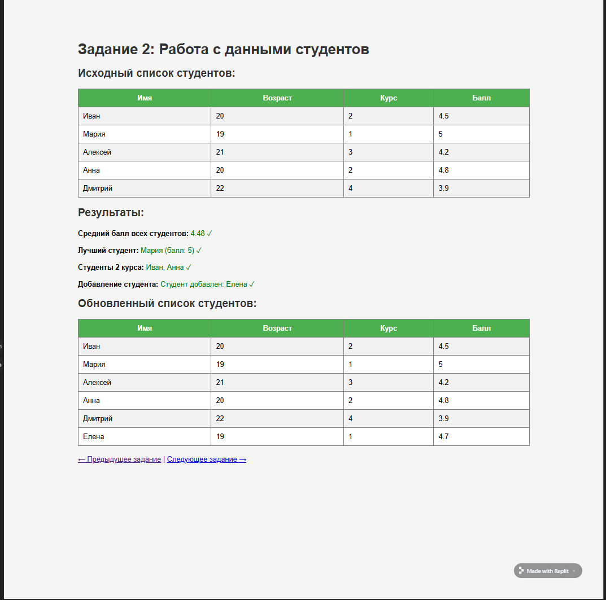
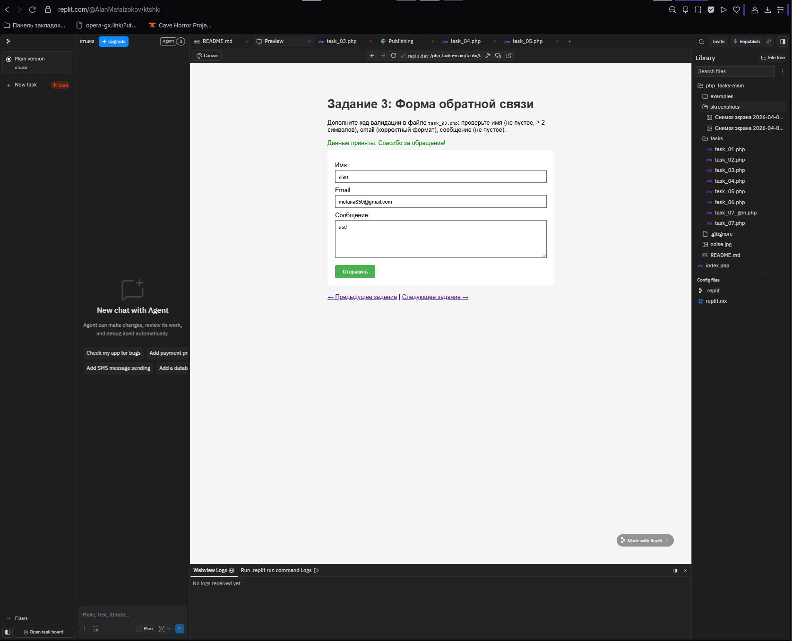
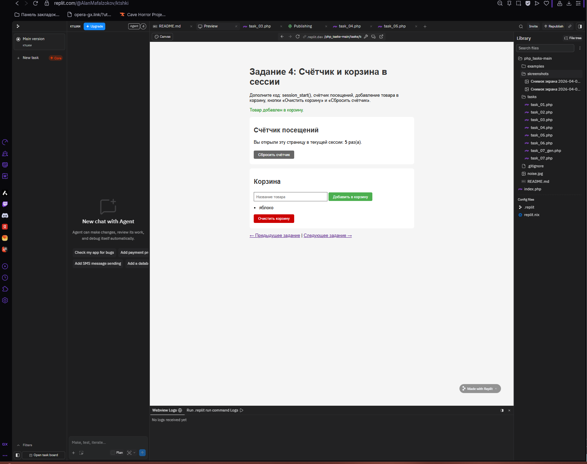
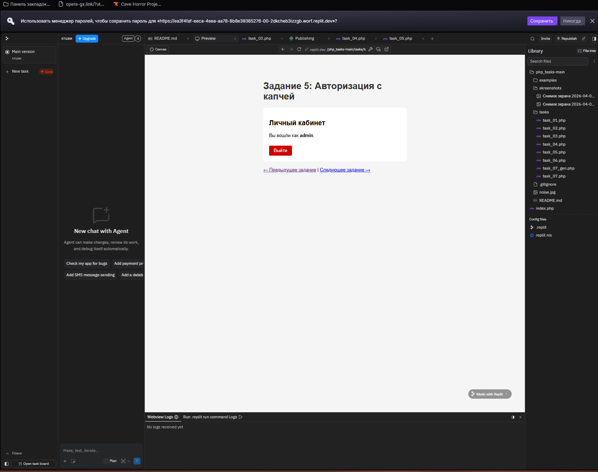
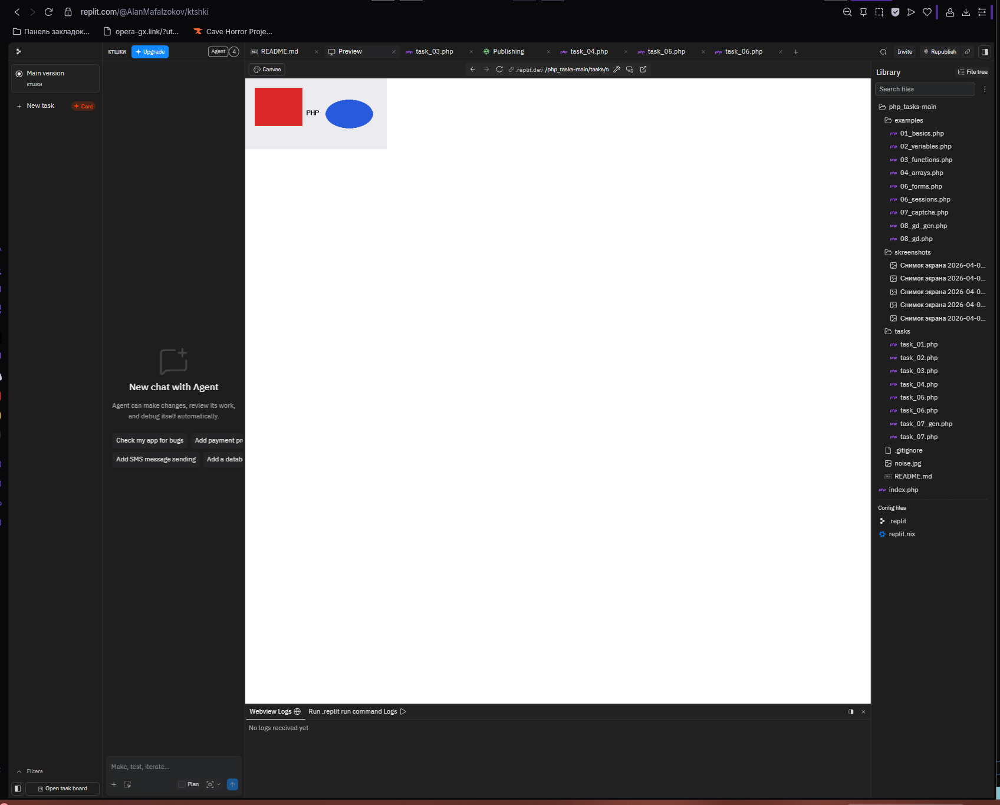
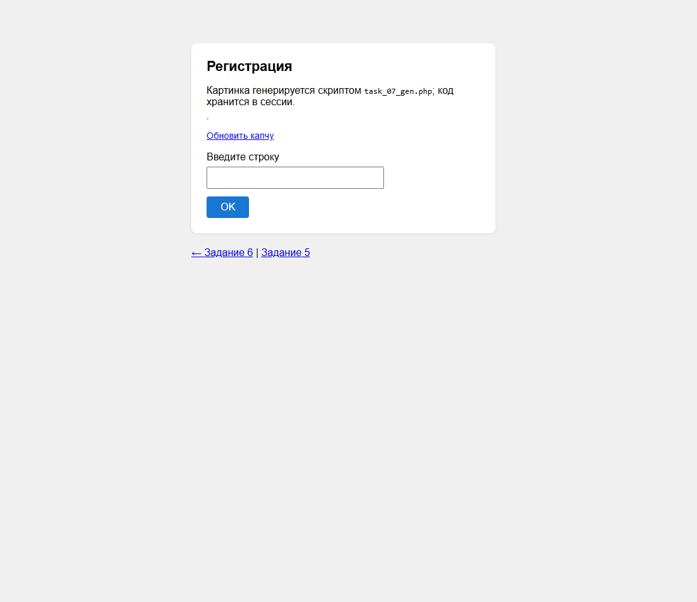

# PHP Tasks - Отчет по выполнению

Репозиторий с условиями: [sa-teach/php_tasks](https://github.com/sa-teach/php_tasks?tab=readme-ov-file)

## О проекте

В этом репозитории выполнены практические задания по PHP (`task_01` - `task_07`).
Все решения находятся в папке `tasks/`.

## Выполненные задания

- `task_01.php` - простой калькулятор (`+`, `-`, `*`, `/`) с обработкой деления на ноль.
- `task_02.php` - работа с массивом студентов (средний балл, лучший студент, фильтр по курсу, добавление студента).
- `task_03.php` - форма обратной связи с валидацией (`name`, `email`, `message`) и выводом ошибок.
- `task_04.php` - сессии: счетчик посещений и корзина с кнопками сброса.
- `task_05.php` - авторизация с текстовой капчей (`admin / 12345`), вход/выход через сессию.
- `task_06.php` - генерация PNG-изображения через GD (фон, фигуры, текст `PHP`).
- `task_07.php` + `task_07_gen.php` + `captcha_lib.php` — CAPTCHA по заданию (шум `noise.jpg`, TTF, сессия, «Правильно» / «Не корректно»).

## Как запустить

1. Открыть терминал в корне проекта.
2. Запустить встроенный сервер PHP:

```powershell
php -S localhost:8000
```

3. Открыть в браузере нужный файл:

- `http://localhost:8000/tasks/task_01.php`
- `http://localhost:8000/tasks/task_02.php`
- `http://localhost:8000/tasks/task_03.php`
- `http://localhost:8000/tasks/task_04.php`
- `http://localhost:8000/tasks/task_05.php`
- `http://localhost:8000/tasks/task_06.php`
- `http://localhost:8000/tasks/task_07.php`

Примечание: адрес `http://localhost:8000/` может выдать `404`, потому что в корне нет `index.php`.

## Скриншоты выполненной работы

### Task 01


### Task 02


### Task 03


### Task 04


### Task 05


### Task 06


### Task 07

